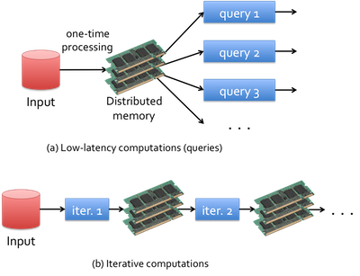

<div style="text-align:left"></div>
<p></p>

1. Fast and general engine for large data processing.<br/>
2. Distributed processing of large data sets.<br/>
3. Cluster computing framework.<br/>
4. Built on top of Hadoop MapReduce.<br/>
5. It extends the MapReduce model to efficiently use more types of computations which includes **stream processing**, **interactive queries**, **batch applications** and **iterative algorithm**.<br/>
6. Spark uses Hadoop in two ways – one is storage and second is processing.<br/>
7. Spark uses **in-memory cluster computing** that increases the processing speed of an application.<br/>
8. Built around one concept - **RDD (Resilient Distributed Datasets)**

<div style="text-align:center"></div>

#### Apache Spark Features

1. **Speed** Run Programs up to 100x times faster than Hadoop MapReduce in memory and 10x times faster on disk (possible by reducing number of r/w operations to disk). It stores the intermediate processing data in memory.

<div style="text-align:center"></div>

2. **DAG (Directed Acyclic Graph)** optimizes workflows.

3. **Advanced Analytics** Spark not only supports ‘Map’ and ‘reduce’. It also supports SQL queries, Streaming data, Machine learning (ML), and Graph algorithms.

#### Spark Built on Hadoop

**Standalone** : Spark Standalone deployment means Spark occupies the place on top of HDFS(Hadoop Distributed File System) and space is allocated for HDFS, explicitly. Here, Spark and MapReduce will run side by side to cover all spark jobs on cluster.

**Hadoop Yarn** : Hadoop Yarn deployment means, simply, spark runs on Yarn (cluster management technology). It helps to integrate Spark into Hadoop ecosystem. It allows other components to run on top of stack.

**Spark in MapReduce (SIMR)** : Spark in MapReduce is used to launch spark job in addition to standalone deployment. With SIMR, user can start Spark and uses its shell without any administrative access.

------------

### Resilient Distributed Datasets (RDD)

**Resilient** : If one node goes down in your cluster it can still recover from that and pickup from where it left off.

**Distributed** : Splits up your data and process across nodes in cluster.

1. Fundamental data structure of Spark.
2. Immutable distributed collection of objects.
3. Each dataset in RDD is divided into logical partitions which may be computed on different nodes of the cluster.
4. RDD can contain any type of objects, including user-defined classes.
8. RDD is a fault-tolerant.

### Spark Context

1. Created by driver program.
2. Responsible for making RDD *resilient* and *distributed*.
3. RDD can also be created from JDBC, Elastic Search, HBase, Cassandra.
4. Load up date from Amazon S3, HDFS.

<div style="text-align:center"></div>

### Transforming RDD's

**map()** apply a function in every row of RDD.

**flatmap()** is similar to map, but each input item can be mapped to 0 or more output items. flatmap can generate many lines from one input line or zero lines.

**filter()** trim down unnecessary data from RDD.

**distinct()** remove duplicate rows from RDD.

**sample()** creates a random sample RDD from input RDD.

**union(), intersection(), subtract(), cartesian()** Perform set operations on RDD between any two RDD's.

All these functions doesn't modify original RDD because it is immutable.

### RDD Actions

**collect()** takes the result of an RDD and passes back to driver script.

**count()** get a count of how many rows are there in RDD.

**countByValue()** returns a Map containing <unique value, count> where *count* is a integer describing how many times each unique value appears.

**take()** returns first k result in RDD.

**reduce()** this actually combine together all the different value associated with a given value (similar to reduce in Hadoop).

**In spark, nothing actually happens until you call an action on RDD. When you call any action, it will go and figure out what's the best optimal path for producing these results. At that point spark construct *Directed Acyclic Graph*, execute it in most optimal manner on cluster.**

### Spark Internals
Step by step description of how spark works internally....
1. A job is broken into stages based on when data needs to be reorganized.
2. Each stage is broken into tasks which may be distributed across a cluster.
3. Finally the task are scheduled across your cluster and executed.


### Key/Value RDD's
Key value RDDs are same as general RDD but it contains data in key value pairs instead of rows. It is just a map pairs of data into the RDD using tuples.You can create pair RDD something like this...

`val keyValuePairRDD = originalRDD.map(x=> (x,1))`

Ok to have tuples or other objects as value as well.

If RDD contains tuples and tuple contains two objects then spark automatically treat that RDD as key/value RDD.

**reduceByKey()** combine value with the same key using some function.

`rdd.reduceByKey((x, y) => x+y)` it adds up all the values of the same key and return a new RDD.

**groupByKey()** - Group value with the same key and returns `(key, List of values of same key)`.

**sortByKey()** - Sort an RDD by key.

**keys()** - Create an RDD of just keys.

**values()** - Create an RDD of just values.

**join, rightOuterJoin, leftOuterJoin, cogroup, subtractByKey** - Create an RDD by doing some SQL style joins on two key/value RDD.

`With key/value data, use mapValues() and flatMapValues() if your transformation doesn't affect the keys. It's more efficient.`

### Broadcast Variables
Broadcast variables allow the programmer to keep a read-only variable cached on each machine rather than shipping a copy of it with tasks.

Explicitly creating broadcast variables is only useful when tasks across multiple stages need the same data.

`sparkContext.broadcast()` : Broadcast objects to executors, such that they are always there whenever needed.

<div style="text-align:center"></div>

### Shared Variables: Accumulators
An accumulator is a shared variable across entire spark cluster. It allows many executors to only add something in a shared variable. Spark natively supports accumulators of numeric types.

An accumulator is created from an initial value v by calling `val accumulator =  SparkContext.accumulator(v)`. Tasks running on the cluster can then add to it using the add method or the += operator.

```scala
  scala> val accumulator = sc.accumulator(0)
  scala> sc.parallelize(Array(1, 2, 3)).foreach(x => accumulator += x)
```

Tasks running on the cluster cannot read accumulator's value. Only the driver program can read the accumulator’s value by using `accumulator.value()`.

### Caching RDD's
Any time you will perform more than one action on an RDD, you must cache it. Otherwise, spark might re-evaluate the entire RDD all over again.

**cache()** - Cache the RDD in memory `StorageLevel.MEMORY_ONLY`.

**persist()** - Cache the RDD in disk.

RDD can be stored using a different storage level.

|   Storage Level	|  Meaning 	|
|:-:	|---	|
|MEMORY_ONLY|Store RDD as deserialized objects in the JVM. If the RDD does not fit in memory, some partitions will not be cached and will be recomputed on the fly each time they're needed. This is the default level.|
|MEMORY_AND_DISK|Store RDD as deserialized objects in the JVM. If the RDD does not fit in memory, store the partitions that don't fit on disk, and read them from there when they're needed.|
|MEMORY_ONLY_SER (Java and Scala)|Store RDD as serialized Java objects (one byte array per partition). This is generally more space-efficient than deserialized objects but more CPU-intensive to read.|
|MEMORY_AND_DISK_SER (Java and Scala)|Similar to MEMORY_AND_DISK but stores RDD as serialized objects.|
|DISK_ONLY|Store the RDD partitions only on disk.|
|MEMORY_ONLY_2, MEMORY_AND_DISK_2|Replicate each partition on two cluster nodes.|

```scala
  import org.apache.spark.storage.StorageLevel._
  RDD.persist(MEMORY_AND_DISK_SER)
```
###### Which Storage Level to Choose?

* If your RDDs fit comfortably with the default storage level (MEMORY_ONLY), leave them that way. This is the most CPU-efficient option, allowing operations on the RDDs to run as fast as possible.
* If not, try using MEMORY_ONLY_SER and selecting a fast serialization library to make the objects much more space-efficient, but still reasonably fast to access.
* Don’t spill to disk unless datasets computation is expensive. Otherwise, recomputing a partition may be as fast as reading it from disk.
* Use the replicated storage levels if you want fast fault recovery.

Spark automatically monitors cache usage on each node and drops out old data partitions in a LRU fashion. If you would like to manually remove an RDD instead of waiting for it to fall out of the cache, use the ```RDD.unpersist()``` method.
